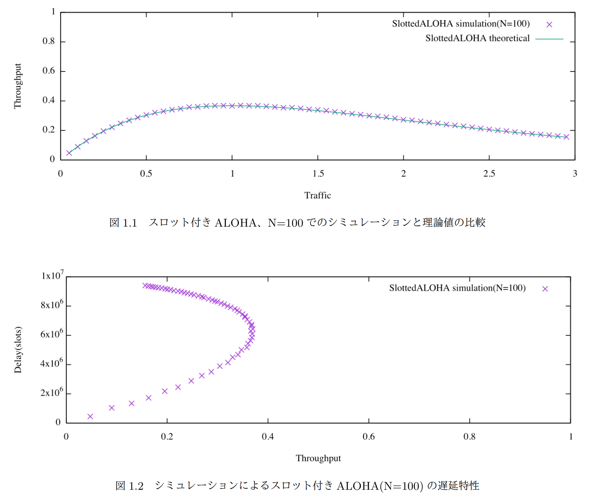
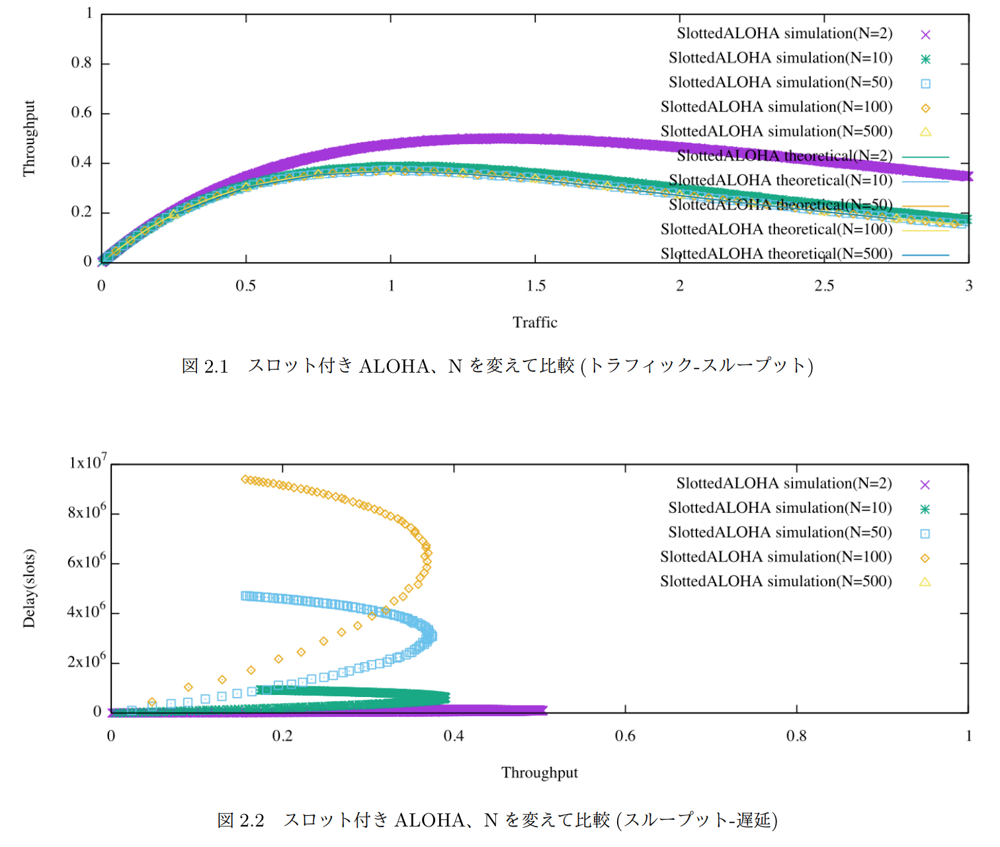
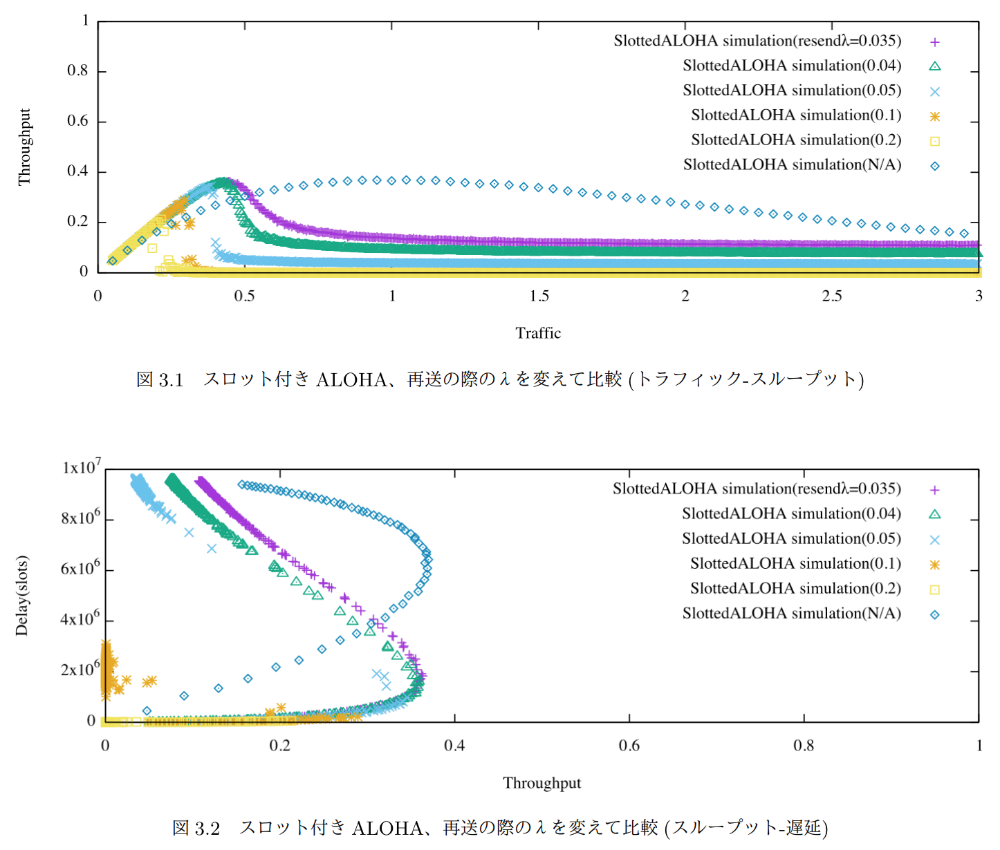

# ALOHA simulator
This is a simple slotted [ALOHA](https://en.wikipedia.org/wiki/ALOHAnet#The_ALOHA_protocol) simulator.  

Given the number of stations and delay time, it outputs delay characteristics and throughput characteristics as space-separated CSV (SSV).







## Usage
```
$ g++ ALOHA.cpp
$ ./a.out
```

## comment
slotted ALOHAとやらのシミュレータ。ローカルリポジトリがどっかいったので履歴なし。
